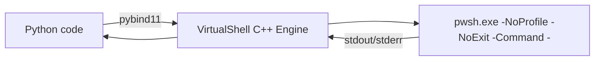

# 🧠 virtualshell

**Run PowerShell like a compiled language.**  
`virtualshell` is a **high-performance C++ bridge** exposing a persistent PowerShell runtime to Python — with **async execution**, **session reuse**, and **millisecond-level latency**.  

Forget the cost of `subprocess.run("pwsh ...")` — now you can run thousands of PowerShell commands per second, reuse modules and environment, and stream results safely from a persistent backend.

---

## 🚀 Why `virtualshell`?

> **"PowerShell automation at C++ speed — controlled from Python."**

`virtualshell` was designed for engineers who integrate PowerShell into larger Python workflows and need:
- 💡 **Low latency** — one persistent PowerShell host instead of spawning a process for each command.  
- ⚙️ **Thread-safe async API** — run hundreds of commands concurrently without GIL blocking.  
- 🧩 **Session state** — keep `$env:*`, modules, and variables alive between invocations.  
- 🔥 **C++ backend** — minimal Python overhead; full parallelism in native threads.  
- 🧱 **Predictable errors** — typed exceptions and structured results.  

Typical use cases:
- Orchestrating Windows services, AD, Exchange, or Azure via Python.  
- Continuous monitoring or job runners that need to execute many PS commands efficiently.  
- Embedding PowerShell automation into async Python web servers or data pipelines.  
- Unit-testing PowerShell scripts programmatically without process churn.

---

## 📦 Installation

```bash
pip install virtualshell
````

Wheels are provided for Windows, Linux (x86_64/aarch64), and macOS (universal2).
Requires **PowerShell (`pwsh`)** or **Windows PowerShell (`powershell`)** in `PATH`.

---

## ⚡ Quick example

```python
from virtualshell import Shell

# Persistent PowerShell session with a 5s timeout
sh = Shell(timeout_seconds=5).start()

print(sh.run("Write-Output 'Hello, World'").out.strip())
# -> Hello, World

# Maintain global variables and modules between calls
sh.run("function Inc { $global:i++; $global:i }")
for _ in range(3):
    print(sh.run("Inc").out.strip())  # 1, 2, 3

sh.stop()
```

Async example:

```python
from virtualshell import Shell
import asyncio

async def main():
    sh = Shell().start()
    fut = sh.run_async("Get-Date")
    res = await asyncio.wrap_future(fut)
    print(res.out.strip())
    sh.stop()

asyncio.run(main())
```

---

## 🧩 Key features

| Capability                     | Description                                                     |
| ------------------------------ | --------------------------------------------------------------- |
| ⚙️ **Persistent session**      | Keep modules, environment, and variables alive between commands |
| ⚡ **Async & batch execution**  | Fire hundreds of PowerShell calls concurrently with callbacks   |
| 🧱 **Script execution**        | Run `.ps1` files with positional or named arguments             |
| ⏱️ **Timeouts & cancellation** | Per-command timeout enforcement in C++ thread watchdog          |
| 🧼 **Clear error semantics**   | Typed exceptions or structured return values                    |
| 🧵 **Thread-friendly**         | No Python GIL locks — all async done in native C++ threads      |
| 🧰 **Cross-platform**          | Works on Windows, Linux, and macOS with `pwsh` 7+               |

---

## 🧠 Design

At its core, `virtualshell` hosts a **long-lived PowerShell process** managed entirely in C++:

* Uses **pipes and overlapped I/O** for full-duplex communication.
* Demultiplexes stdout/stderr at high throughput (64 KB buffers).
* Handles per-command timeouts and futures natively.
* Provides a clean Python API via **pybind11**.

This design eliminates the startup cost (~200 ms+) of each PowerShell invocation and allows PowerShell to behave like a coroutine-friendly REPL that Python controls.



---

## 🧪 API overview

```python
from virtualshell import Shell

sh = Shell(timeout_seconds=3).start()

# One-liner
res = sh.run("Get-Process | Select -First 1")
print(res.out)

# Script (positional)
sh.run_script("C:/temp/test.ps1", args=["alpha", "42"])

# Script (named)
sh.run_script_kv("C:/temp/test.ps1", named_args={"Name":"Alice","Count":"3"})

# Async with callback
def on_done(result):
    print("Exit:", result.exit_code, "Took:", result.execution_time, "s")

sh.run_async("Get-Random", callback=on_done)

sh.stop()
```

---

## 📊 Performance snapshot

| Operation                      | subprocess (ms) | virtualshell (ms) |
| ------------------------------ | --------------- | ----------------- |
| Start PowerShell & run command | 200–400 ms      | **≈ 1–3 ms**      |
| 1000 sequential commands       | ~60 s           | **< 2 s**         |
| Async batch (10× parallel)     | n/a             | **sub-second**    |

*(Benchmarks measured on Windows 11, PowerShell 7.4, Python 3.12)*

---

## 🧰 Exception model

```python
from virtualshell.errors import (
    ExecutionError,
    ExecutionTimeoutError,
    PowerShellNotFoundError,
)

try:
    sh.run("throw 'boom'", raise_on_error=True)
except ExecutionTimeoutError:
    print("Command timed out!")
except ExecutionError as e:
    print("PowerShell failed:", e)
```

---

## 🔧 Configuration

```python
from virtualshell import Shell

sh = Shell(
    powershell_path=r"C:\Program Files\PowerShell\7\pwsh.exe",
    environment={"MY_ENV": "123"},
    initial_commands=[
        "$ErrorActionPreference = 'Stop'",
        "$OutputEncoding = [Console]::OutputEncoding = [Text.UTF8Encoding]::new()"
    ],
)
```

All configuration is applied before startup — you can introspect or update via `.get_config()` / `.update_config()` if the process is stopped.

---

## 🧱 Building from source

Requirements:

* Python ≥3.8
* CMake ≥3.20
* C++17 compiler
* `scikit-build-core`, `pybind11`

```bash
python -m pip install -U build
python -m build
python -m pip install dist/virtualshell-*.whl
```

---

## 🗺️ Roadmap

* ✅ Windows, Linux, macOS wheels
* ✅ Async batch execution
* ⏳ Streaming I/O events and progress API
* ⏳ Rich typed outputs for PowerShell objects

---

## 📄 License

Apache 2.0 — see [LICENSE](LICENSE)

---

**VirtualShell** bridges **Python’s orchestration power** with **PowerShell’s system control** —
without the latency of spawning processes or the fragility of subprocess pipes.

> *“If you use PowerShell in your workflow more than once per second — you want VirtualShell.”*
